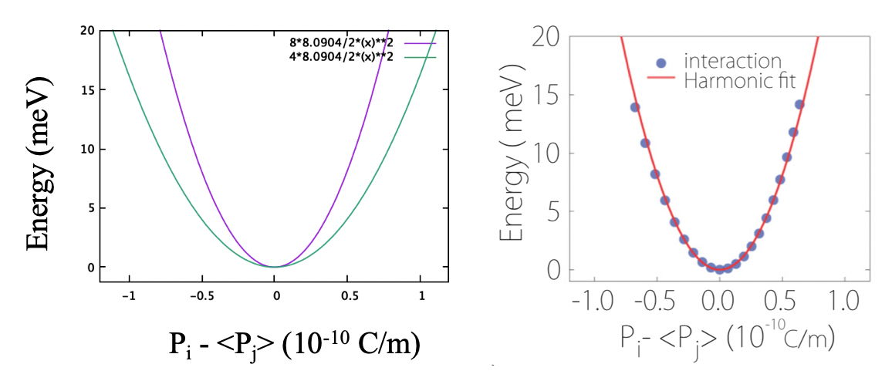
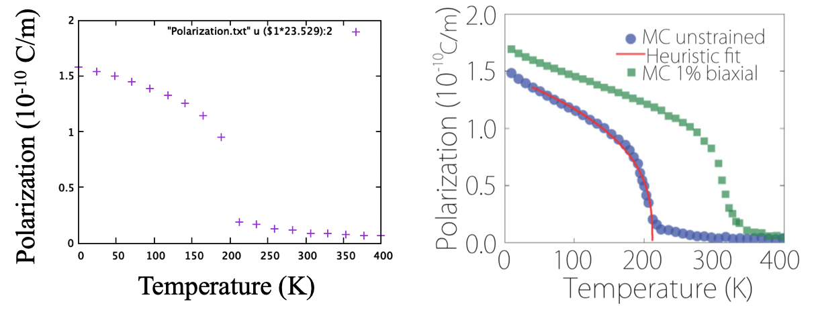

## Discrepancies

1. The harmonic coupling plot (energy vs P_i-<P_j>)cannot be reproduced using the provided coupling coefficient `D=8.0904`. The 2D lattice have 4 nearest neighbour, which means:
```
E=4*D/2*(P_i-<P_j>)^2
```
But the plot actually show:
```
E=8*D/2*(P_i-<P_j>)^2
```
two times higher than the provided coupling coefficient.



2. Despite the difference between the the coupling plot and provided coupling coefficient, using mpiPyMC, I am able to plot the phase transition identical to the paper and get same T_c for FE to turn PE.


