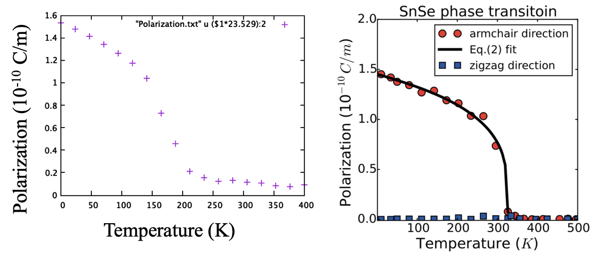
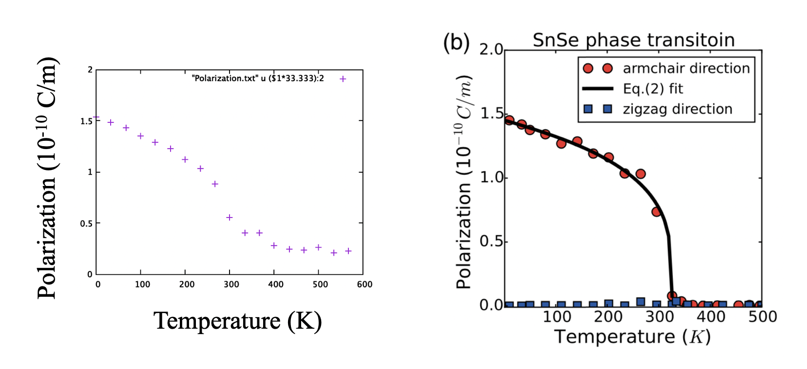

## SnSe calculation

1. Using provided parameters, I am not able to plot the phase transition as published in [paper](https://link.aps.org/doi/10.1103/PhysRevLett.117.097601). The T_c I got for FE to turn PE is around 180K, similar to that of SnTe.

2. Using twice the provided coupling parameter, the calculated transition temperature is around 320K, similar to the published result.

3. The spontaneous polarization value at ZERO K is around 1.45, this does not agree with the one they provided in the paper (1.51).

## Parameters
| NAME                   | DATA                                       |
|:----------------------:|:------------------------------------------:|
| `nt`                   | 18                                         |
| `N`                    | 30                                         |
| `eqSteps`              | 8000                                       |
| `mcSteps`              | 4000                                       |
| `A_data` `B_data` `C_data` `D_data`| -5.785, 1.705, 0.317, 10.16    |
| `ps`                   | 1.51                                       |
| `T`                    | 0.01, 400                                  |
